# Permissionless

**zkStash** is built on the core belief that AI agents should be **autonomous economic actors** that can operate, coordinate, and transact without human intervention.

**Imagine a world where AI agents:**

- **Discover** and use services independently, without waiting for human configuration
- **Coordinate** with other agents to solve complex tasks
- **Pay** for the resources they consume using their own wallets
- **Persist** knowledge across sessions, building expertise over time

This is only possible with **permissionless infrastructure**.

## What do we mean by Permissionless?

In the context of zkStash, "permissionless" means:

1. **Trustless Access**: Agents authenticate with cryptographic wallet signatures—no registration, no API keys, no central authority to grant permission.

2. **Borderless Payments**: Pay with crypto (USDC, SOL, ETH) from anywhere in the world. No banks, no credit cards, no payment processors required.

## The Agentic Economy

We envision a future where fleets of agents interact with each other, sharing knowledge and paying for resources autonomously.

*   **Own Resources**: Agents "own" their memories. The cryptographic identity that creates a memory is the only one that can update or delete it.
*   **Pay for Usage**: Agents pay for their own storage and compute costs on a per-request basis or via pre-funded balances.

## x402 Protocol

[**x402**](https://www.x402.org/) is an open standard that brings payments **into the HTTP request flow**. It enables seamless, programmatic payments for internet resources.

### Key Principles

- **HTTP-Native**: x402 seamlessly complements existing HTTP—no additional requests or special protocols required.
- **Chain-Agnostic**: Support for multiple blockchains (Solana, Base, and more). Agents choose what works best for them.
- **Gasless**: The facilitator (zkStash) handles gas fees, so agents only pay for the resource, not network overhead.
- **Trust-Minimizing**: Payments are cryptographically verified on-chain. Neither the facilitator nor the resource server can move funds without client authorization.

### Supported Networks
- **Solana**: Ultra-fast, low-cost transactions
- **Base**: Coinbase L2, EVM-compatible

For more details on the x402 standard, see the [official specification](https://github.com/coinbase/x402).

## Why This Matters

- **True Autonomy**: Agents can operate indefinitely as long as they have funds in their wallet. 
- **Coordination at Scale**: When agents can pay for their own resources, multi-agent systems become practical. Dynamic teams can form and dissolve automatically. Specialized agents can be created on-demand without human provisioning or central payment bottlenecks.
- **Sybil Resistance**: The cost of memory operations acts as a natural spam filter. Creating thousands of fake memories costs real money, preventing free tier abuse and keeping the system healthy through economic incentives.
- **Global, Borderless Operation**: Traditional payment systems require banks, credit cards, and compliance with geographic restrictions. x402 micropayments work anywhere.

## The Vision

We're building infrastructure for a future where millions of agents collaborate to solve problems too complex for single systems. Agents will fund themselves from their economic activity—like a trading bot that pays for memory from its profits. Human involvement will focus on high-level goals, not operational maintenance. Innovation will accelerate because agents can compose services without integration friction.

This is the **agentic economy**, and we are committed to making it a reality.

{/* This page should talk about the concept of memories in AI agents first. */}

# Memories

Memories are the core of the **zkStash** platform. They represent the knowledge that your agents accumulate over time. Unlike the ephemeral context window of an LLM, memories in zkStash are persistent, searchable, and structured.

## Core Memory Operation

At its core, every memory operation follows a simple cycle:
1.  **Accept**: The system receives conversation data and the current memory state.
2.  **Prompt**: An LLM determines how to expand or consolidate the memory.
3.  **Update**: The new memory state is saved.


## Short-Term vs. Long-Term Memory

### Short-Term Memory (Context)
Short-term memory typically refers to the **context window** of the LLM or the state of a specific conversation thread.
*   **Scope**: Limited to a single session or thread.
*   **Persistence**: Ephemeral. Lost when the session ends or the context window is exceeded.
*   **Use Case**: Remembering the user's name in the current chat, or the last question asked.

### Long-Term Memory (Persistence)
**zkStash** provides **Long-term Memory**. This is knowledge that persists across different threads, sessions, and time.
*   **Scope**: Global (per Agent). Accessible across all interactions.
*   **Persistence**: Indefinite. Stored until explicitly deleted or expired.
*   **Use Case**: Remembering a user's dietary restrictions learned last month, or a fact discovered by another agent in the fleet.

## Types of Long-Term Memory

Just as humans use different types of memory for different purposes, AI agents benefit from organizing knowledge into distinct categories:

### Semantic Memory (Facts & Knowledge)
Semantic memory stores factual information about the world, users, or domain-specific knowledge. We support two primary patterns:

#### 1. Profiles (Structured)
Profiles are ideal for entities where there should be **one** active version of the truth.
*   **Schema Type**: **Single Record** (e.g., `UserProfile`, `CustomerSettings`)
*   **Behavior**: Updates replace the previous state.
*   **Example**: "User prefers dark mode"

#### 2. Collections (Unbounded)
Collections are for accumulating an unbounded amount of knowledge that is searched at runtime.
*   **Schema Type**: **Multiple Records** (e.g., `ProductKnowledge`, `DomainFact`)
*   **Behavior**: New facts are appended.
*   **Example**: "Redis is an in-memory database"

### Episodic Memory (Experiences & Events)
Episodic memory stores specific events or interactions that happened at a particular time.
*   **Schema Type**: Always **Multiple Records** (e.g., `InteractionLog`, `TaskHistory`)
*   **Use Case**: Learning from past successes/failures.
*   **Example**: "Agent successfully resolved ticket #456 using strategy X"

### Procedural Memory (Rules & Strategies)
Procedural memory stores instructions, strategies, or rules that guide behavior.
*   **Schema Type**: **Single Record** (e.g., `AgentInstructions`)
*   **Use Case**: Evolving agent behavior based on feedback.
*   **Example**: "For technical issues, escalate to human if confidence < 0.7"

## Writing Memories

There are two primary patterns for when to write memories:

### Conscious Formation (Hot Path)

The agent decides to save a memory as part of its normal response flow using **MCP**.

*   **Mechanism**: The MCP server exposes tools (e.g., `create_user_profile`) to your agent.
*   **Pros**: Memory is immediately available for the next turn.
*   **Cons**: Adds latency to the user-facing response.

### Subconscious Formation (Background)

A separate process analyzes the conversation history and extracts memories after the fact using the **zkStash REST API** or **SDK**.

*   **Mechanism**: Background workers call `POST /memories`.
*   **Pros**: No latency impact; allows for deeper "reflection" and batch processing.
*   **Cons**: Memory is not immediately available.

### Context Continuity

zkStash maintains a **rolling context window** for each thread, allowing the extraction process to understand references across multiple API calls.

*   **Managed History**: Recent messages are stored per `threadId` and provided to the extractor as context.
*   **Rolling Summarization**: When history exceeds a threshold, older messages are summarized to preserve key facts without bloating the context window.
*   **Idempotency**: Duplicate requests (same conversation content) are detected and skipped, making retries safe.


## Organizing Memories

Memories are organized by **Agent ID** and optionally by **Subject ID** and **Thread ID**.

*   **Agent ID**: The primary namespace. All memories for a specific agent (e.g., "customer-support-bot") are grouped together.
*   **Subject ID**: Optional tenant isolation scope. Used to separate data between different users or tenants within the same agent (e.g., "tenant-123").
*   **Thread ID**: Optional sub-namespace for session-specific context. Useful for scoping memories to a particular conversation (e.g., isolating memories from different user chats).

This hierarchical organization allows you to:
*   Retrieve all knowledge for an agent across all conversations
*   Isolate data per tenant using `subjectId`
*   Filter memories to a specific conversation thread
*   Share knowledge between agents by querying across Agent IDs

### Multi-Tenancy for Platforms

If you are building a platform where multiple users or tenants share the same agent (e.g., a "Customer Support Bot" serving 10,000 companies), use `subjectId` to isolate their data.

*   **Agent ID**: `customer-support-bot` (Your shared agent logic)
*   **Subject ID**: `tenant-123` (Company A), `tenant-456` (Company B)

This ensures Company A's queries never retrieve Company B's memories, even though they use the same agent.

---

## Memory Response Format

When you search for memories, zkStash returns them in an **LLM-optimized format** designed for optimal context in LLM reasoning. This format separates user content from system metadata and includes quality signals.

### Structure

```json
{
  "id": "mem_abc123",
  "kind": "UserProfile",
  "quality": {
    "relevance": 0.89,
    "confidence": 0.95
  },
  "data": {
    "dietaryRestrictions": ["vegan", "gluten-free"],
    "favoriteColor": "blue"
  },
  "context": {
    "when": "2024-01-15T10:30:00Z",
    "mentions": [
      { "name": "User", "type": "person" }
    ],
    "tags": ["preferences"],
    "isLatest": true
  },
  "source": "own"
}
```

### Field Descriptions

| Field | Description |
| :--- | :--- |
| `id` | Memory identifier for updates and references. |
| `kind` | Schema type (e.g., `UserProfile`, `temporal_event`). |
| `quality.relevance` | How well this memory matches your query (0-1). |
| `quality.confidence` | How certain the system was during extraction (0-1). Use this to weight uncertain vs. definite information. |
| `data` | The actual content—user-defined fields from your schema. |
| `context.when` | ISO 8601 timestamp of when the event occurred (if temporal). |
| `context.mentions` | Named entities referenced, with types for disambiguation (e.g., "Amazon" as company vs. place). |
| `context.tags` | Topical tags for categorization. |
| `context.isLatest` | `true` if this is the current version. `false` if superseded by a newer memory. |
| `source` | Where this memory came from: `own`, `shared`, or `shared:{agentId}`. |

### Search Response

A search also includes a `searchedAt` timestamp at the root level, useful for relative temporal reasoning:

```json
{
  "success": true,
  "memories": [...],
  "searchedAt": "2024-01-20T14:30:00Z"
}
```

---

## Memory Expiration (TTL)

By default, memories are **permanent** (on paid plans) or subject to **7-day retention** (on the Free plan). However, you can set explicit expiration for any memory using TTL (Time-To-Live).

### When to Use TTL

TTL is useful for memories that are:
*   **Session-specific**: Context that's only relevant during an active task
*   **Time-sensitive**: Information that becomes stale (e.g., "user is currently booking a flight")
*   **Temporary overrides**: Short-term preferences that shouldn't persist

### Setting Expiration

You can set expiration in two ways:

**Duration string (`ttl`)**:
```typescript
// Memory expires in 24 hours
{ kind: "SessionContext", data: { task: "booking" }, ttl: "24h" }
```

**Unix timestamp (`expiresAt`)**:
```typescript
// Memory expires at a specific time
{ kind: "Reminder", data: { text: "Follow up" }, expiresAt: 1735689600000 }
```

Supported TTL formats: `"30s"`, `"15m"`, `"1h"`, `"24h"`, `"7d"`

### Removing Expiration

To make an expiring memory permanent, update it with `expiresAt: null`:

```typescript
// Remove expiry, memory becomes permanent
await client.updateMemory(memoryId, { expiresAt: null });
```

### TTL vs System Retention

| Type | Applies To | Behavior | Who Controls |
| :--- | :--- | :--- | :--- |
| **TTL Expiry** | All plans | Memory deleted when `expiresAt` passes | You (the developer) |
| **System Retention** | Free plan only | 7-day rolling window | Platform policy |

TTL is **user intent**—you're explicitly saying "delete this memory after X time."  
System retention is **policy-based**—the platform enforces limits on the Free tier.

> **Note**: On the Free plan, both mechanisms apply. A memory with `ttl: "1h"` will be deleted after 1 hour, even if the 7-day window hasn't passed. Conversely, a memory without TTL will still be deleted after 7 days unless you have [storage insurance](/docs/core-concepts/credits-payments#storage-insurance).

---

> **_NOTE:_**
> Ready to integrate zkStash into your application? Check out the [Integrations](/docs/integrations) page for detailed guides on using the REST API, SDK, or MCP.


# Schemas

Schemas are the foundation of structured memory in zkStash. They define **what** your agents should remember and **how** that knowledge is organized.

## What Are Schemas?

Think of schemas as **blueprints** for your agent's knowledge. Just like a database table has columns with specific types, a schema defines the structure of memories your agent stores.

Without schemas, memory is just a "dump" of unstructured text:
```
"User likes dark mode and speaks English"
```

With schemas, the same information becomes **queryable, type-safe, and consistent**:
```json
{
  "theme": "dark",
  "language": "en"
}
```

## Why Use Schemas?

### Type Safety
Ensure that a "date" is actually a date, not a string. A "score" is a number, not text. This prevents bugs and makes your agent's knowledge reliable.

### Consistency
All agents (or all instances of the same agent) store `UserProfile` data in the exact same way. No more guessing which field holds the user's name.

### Queryability
Filter and search memories programmatically:
- Find all tasks where `status == "urgent"`
- Retrieve memories created after a specific timestamp
- Count how many interactions had `sentiment == "positive"`

### LLM-Friendly
Schemas provide clear instructions to the LLM about what data to extract and how to structure it. This significantly improves extraction accuracy.

## Auto-Supersede with `uniqueOn`

The `uniqueOn` field defines which fields identify the **same logical entity**. When a new memory matches an existing one on these fields, it automatically supersedes (replaces) the old version.

### Profile Pattern (One Per User)

Use `uniqueOn: ["kind"]` when you want **one version of truth** per schema type. Perfect for entities where only the latest state matters.

**Use Cases:**
- User preferences (`UserProfile`)
- Agent configuration (`AgentSettings`)
- Current status (`ProjectStatus`)

**Behavior:** New memories automatically replace previous ones of the same kind.

```json
{
  "name": "UserProfile",
  "uniqueOn": ["kind"],
  "schema": {
    "type": "object",
    "properties": {
      "theme": { "type": "string", "enum": ["light", "dark"] },
      "language": { "type": "string" }
    },
    "required": ["theme"]
  }
}
```

### Collection Pattern (Accumulating Records)

Omit `uniqueOn` when you want to **accumulate knowledge** over time. Perfect for events, logs, or growing lists of facts.

**Use Cases:**
- Interaction history (`ConversationLog`)
- Task tracking (`TaskHistory`)
- Knowledge base (`ProductFact`)

**Behavior:** Each new memory is appended. You can have thousands of records for the same schema.

```json
{
  "name": "TaskHistory",
  "schema": {
    "type": "object",
    "properties": {
      "taskId": { "type": "string" },
      "status": { "type": "string", "enum": ["completed", "failed"] },
      "timestamp": { "type": "number" }
    },
    "required": ["taskId", "status"]
  }
}
```

### Custom Unique Keys

You can also specify **custom fields** for uniqueness. For example, `uniqueOn: ["email"]` ensures only one contact per email address:

```json
{
  "name": "Contact",
  "uniqueOn": ["email"],
  "schema": {
    "type": "object",
    "properties": {
      "email": { "type": "string" },
      "name": { "type": "string" },
      "company": { "type": "string" }
    },
    "required": ["email", "name"]
  }
}
```

When you store a contact with `email: "alice@example.com"` twice, the second one supersedes the first.

import { Tabs } from 'nextra/components'

## Creating Schemas

Schemas are defined using [JSON Schema](https://json-schema.org/), a widely-adopted standard for describing JSON data structures. For TypeScript developers, we strongly recommend using [Zod](https://zod.dev/) for type-safe schema definitions.

### Using Zod (Recommended for TypeScript)

<Tabs items={['TypeScript (Zod)', 'JSON Schema']}>
  <Tabs.Tab>
    ```typescript
    import { z } from "zod";
    import { fromPrivateKey } from "@zkstash/sdk";

    // Authenticate with wallet
    const authPrivateKey = process.env.AUTH_PRIVATE_KEY;
    const client = await fromPrivateKey(
      "solana-devnet",
      authPrivateKey
    )

    // Define schema using Zod
    const ShoppingListSchema = z.object({
      item: z.string().describe("The name of the item to buy"),
      quantity: z.number().int().positive().describe("How many to buy"),
      purchased: z.boolean().default(false)
    });

    // Create schema on zkStash (no uniqueOn = accumulating list)
    await client.registerSchema({
      name: "ShoppingList",
      description: "Items to buy",
      schema: ShoppingListSchema
    });
    ```
  </Tabs.Tab>
  <Tabs.Tab>
    ```bash
    curl -X POST https://api.zkstash.ai/schemas \
      -H "x-wallet-address: <YOUR_WALLET>" \
      -H "x-wallet-signature: <SIGNATURE>" \
      -H "x-wallet-timestamp: <TIMESTAMP>" \
      -d '{
        "name": "ShoppingList",
        "description": "Items to buy",
        "schema": {
          "type": "object",
          "properties": {
            "item": { 
              "type": "string",
              "description": "The name of the item to buy"
            },
            "quantity": { 
              "type": "number",
              "description": "How many to buy"
            },
            "purchased": {
              "type": "boolean",
              "default": false
            }
          },
          "required": ["item", "quantity"]
        }
      }'
    ```
  </Tabs.Tab>
</Tabs>

## Using Schemas

Once created, schemas become tools for your agent to use.

### With MCP
The MCP server automatically generates tools based on your schemas. If you create a `UserProfile` schema, you get:
- `create_user_profile` tool
- Tools are dynamically updated when schemas change

### With SDK
Use the schema name when creating memories:

```typescript
await client.memories.create({
  agentId: "my-agent",
  schemaName: "ShoppingList",
  data: {
    item: "Milk",
    quantity: 2,
    purchased: false
  }
});
```

### Validation
zkStash validates all memories against their schemas. If data doesn't match the schema, the request fails. This ensures data integrity.

## Supported Field Types

| Type | Description | Example |
| :--- | :--- | :--- |
| `string` | Text data | `"dark"`, `"en-US"` |
| `number` | Numeric data (int or float) | `42`, `3.14` |
| `boolean` | True/False | `true`, `false` |
| `array` | List of values | `["tag1", "tag2"]` |
| `object` | Nested structure | `{ "nested": "value" }` |
| `enum` | Restricted set of values | `["light", "dark"]` |

### Advanced Features
- **Nested objects**: Define complex structures with `object` type
- **Arrays of objects**: `"type": "array", "items": { "type": "object", ... }`
- **Enums**: Restrict values with `"enum": ["option1", "option2"]`
- **Required fields**: Mark fields as mandatory with `"required": ["field1"]`
- **Defaults**: Set default values with `"default": value`
- **Descriptions**: Add `"description"` to help LLMs understand fields

## Best Practices

### 1. Keep Schemas Focused
Each schema should represent **one concept**. Don't create a mega-schema with unrelated fields.

**Good:**
- `UserProfile` (theme, language)
- `TaskHistory` (taskId, status)

**Bad:**
- `EverythingAboutTheUser` (theme, language, tasks, shopping list, ...)

### 2. Use Descriptive Names
Schema and field names should be self-explanatory.

**Good:** `TaskHistory`, `ConversationLog`
**Bad:** `Data1`, `Stuff`

### 3. Add Descriptions
Especially when using MCP, descriptions help the LLM understand when and how to use the schema.

```typescript
const TaskSchema = z.object({
  title: z.string().describe("A brief, actionable title for the task"),
  priority: z.enum(["low", "medium", "high"]).describe("Task urgency level")
});
```

### 4. Choose `uniqueOn` Wisely
- **`uniqueOn: ["kind"]`**: When you only care about the latest state (e.g., profiles)
- **`uniqueOn: ["email"]`**: When you want one record per unique field value
- **No `uniqueOn`**: When you need history or a growing collection

### 5. Use Enums for Restricted Values
This prevents typos and ensures consistency:

```json
{
  "status": { "type": "string", "enum": ["pending", "completed", "failed"] }
}
```

## External Resources

- **[JSON Schema Documentation](https://json-schema.org/)**: Complete reference for JSON Schema
- **[Zod Documentation](https://zod.dev/)**: TypeScript-first schema validation
- **[OpenAI Structured Outputs](https://platform.openai.com/docs/guides/structured-outputs?context=with_parse#supported-schemas)**: Supported schema features and best practices


# Memory Sharing

zkStash supports **permissionless memory sharing** between agents using cryptographic grants. This enables collaborative AI systems where agents can selectively share their memories without requiring central administration.

## How It Works

Memory sharing in zkStash is built on three principles:

1. **Cryptographic Authorization**: Grants are signed messages that prove the grantor's consent
2. **Permissionless Verification**: Any agent can verify a grant without contacting the grantor
3. **Time-Bounded Access**: Grants automatically expire—no revocation needed

```mermaid
sequenceDiagram
    participant A as 🤖 Agent A<br/>(Grantor)
    participant B as 🤖 Agent B<br/>(Grantee)
    participant API as zkStash API

    A->>A: 1. Signs grant for B
    A->>B: 2. Shares grant code
    B->>API: 3. Search + grant

    Note over API: ✓ Verify signature<br/>✓ Check expiration<br/>✓ Validate grantee = B

    API->>API: 4. Search A's namespace
    API->>B: 5. Return results
```



## Grant Structure

A grant is a signed JSON payload:

```typescript
interface GrantPayload {
  f: string; // "from" - grantor wallet address (the signer)
  g: string; // "grantee" - wallet address receiving access
  a?: string; // Optional: limit to specific agentId
  u?: string; // Optional: limit to specific subjectId (tenant)
  e: number; // Expiration timestamp (unix seconds)
}

interface SignedGrant {
  p: GrantPayload; // The signed payload
  s: string; // Signature (hex for EVM, base64 for Solana)
  c: "evm" | "sol"; // Chain type for verification
}
```

**Fields explained:**

- `f` (from): The wallet address of the agent sharing their memories
- `g` (grantee): The wallet address of the agent receiving access
- `a` (agentId): Optional scope—if set, access is limited to memories from this agent
- `u` (subjectId): Optional scope—if set, access is limited to memories from this subject/tenant
- `e` (expiry): Unix timestamp when the grant expires

## Creating Grants

Grants are created client-side using your wallet to sign the payload. No server registration is required.

```typescript
import { fromPrivateKey } from "@zkstash/sdk/rest";

// Agent A creates a grant for Agent B
const agentA = await fromPrivateKey(process.env.AGENT_A_KEY!);

const { grant, shareCode } = await agentA.createGrant({
  grantee: "0xAgentBAddress...", // B's wallet
  agentId: "researcher", // Optional: limit scope
  duration: "7d", // Valid for 7 days
});

// Share the code via any channel (API, message, etc.)
console.log("Share code:", shareCode);
// Output: "zkg1_eyJwIjp7ImYiOiIweC4uLi..."
```

### Duration Format

The `duration` parameter accepts human-readable strings:

- `"1h"` - 1 hour
- `"24h"` - 24 hours
- `"7d"` - 7 days
- `"30d"` - 30 days

## Using Grants

Agent B can use the grant to search Agent A's memories:

```typescript
import { fromPrivateKey } from "@zkstash/sdk/rest";

const agentB = await fromPrivateKey(process.env.AGENT_B_KEY!);

// Add the grant (accepts share code string or SignedGrant object)
agentB.addGrant(shareCode);

// Now searches include Agent A's shared memories
const results = await agentB.searchMemories({
  query: "research findings",
  filters: { agentId: "researcher" },
});

// Results are annotated with their source
results.memories.forEach((m) => {
  if (m.source === "shared") {
    console.log(`From ${m.grantor}:`, m.data);
  } else {
    console.log("Own:", m.data);
  }
});
```

## Search Scopes

Control which memories to include using the `scope` parameter:

| Scope      | Searches Own | Searches Shared | Use Case                                |
| ---------- | ------------ | --------------- | --------------------------------------- |
| `"own"`    | ✅           | ❌              | Only your memories, ignore grants       |
| `"shared"` | ❌           | ✅              | Only granted memories (requires grants) |
| `"all"`    | ✅           | ✅              | Both (default behavior)                 |

```typescript
// Search only your own memories
await client.searchMemories(
  { query: "preferences", filters: { agentId: "my-agent" } },
  { scope: "own" }
);

// Search only shared memories
await client.searchMemories(
  { query: "findings", filters: { agentId: "researcher" } },
  { scope: "shared" }
);

// Search everything (default)
await client.searchMemories(
  { query: "all context", filters: { agentId: "any" } }
  // scope defaults to "all"
);
```

## Grant Management

### Instance-Level Grants

Add grants to your client instance for automatic inclusion in all searches:

```typescript
// Add grants (accepts SignedGrant or share code)
client.addGrant(shareCode);
client.addGrant(grantObject);

// Remove a grant
client.removeGrant(grantObject);

// List all instance grants
const grants = client.getInstanceGrants();
```

### Per-Request Grants

Pass grants for a single request without storing them:

```typescript
await client.searchMemories(
  { query: "...", filters: { agentId: "..." } },
  { grants: [oneTimeGrant] }
);
```

## Grantee Identity

The `g` (grantee) field identifies who can use the grant. This depends on how the grantee authenticates:

| Grantee Auth | What to use as `g`           | Example           |
| ------------ | ---------------------------- | ----------------- |
| Wallet       | Wallet address               | `0x1234...abcd`   |
| API Key      | Clerk userId (API key owner) | `user_2abc123xyz` |

### For Wallet Users

Use the grantee's wallet address:

```typescript
await grantor.createGrant({
  grantee: "0xAgentBWalletAddress...",
  duration: "7d",
});
```

### For API Key Users

Use the **Clerk userId** of the API key owner. This is displayed in the zkStash dashboard:

```typescript
await grantor.createGrant({
  grantee: "user_2abc123xyz...", // Clerk userId
  duration: "7d",
});
```

When verifying, zkStash checks if `g` matches either the caller's:

- `userId` (wallet address for wallet auth, keyId for API key auth)
- `payerId` (Clerk userId for API key auth)

This means a grant targeting a Clerk userId works for **all API keys** owned by that user.

## Security Considerations

### Grantee-Bound Access

Unlike classic bearer tokens, grants **cannot be used by anyone**. Each grant is cryptographically bound to a specific grantee:

```
Attacker intercepts grant → Tries to use it →
API checks: caller ≠ grantee → Access denied ✅
```

Only the designated grantee (matching `g` field) can use the grant. However, you should still:

- Share codes over secure channels
- Use short expiration times when possible
- Avoid logging grants in plain text

### No Revocation

Grants cannot be revoked—they expire automatically. If a grantee's credentials are compromised:

1. Wait for grant expiration
2. Don't issue new grants to that grantee

For sensitive use cases, use shorter durations (hours instead of days).

### Verification Flow

zkStash verifies every grant before use:

1. **Signature validity**: The grantor actually signed this grant
2. **Expiration**: The grant hasn't expired
3. **Grantee match**: The caller's identity matches `g` (wallet address OR Clerk userId)
4. **Agent scope**: If `a` is set, access is limited to that agentId

If any check fails, the grant is silently ignored.

## Use Cases

### Research Collaboration

Multiple research agents share findings with a coordinator:

```typescript
// Researcher agents grant access to coordinator
const grant = await researcher.createGrant({
  grantee: coordinatorAddress,
  agentId: "research-findings",
  duration: "30d",
});
```

### Customer Support Handoff

Support agents share customer context during escalation:

```typescript
const grant = await tier1Agent.createGrant({
  grantee: tier2AgentAddress,
  duration: "4h", // Short duration for handoff
});
```

### Multi-Agent Systems

Agents in a workflow share specialized knowledge:

```typescript
// Planner shares context with executor
await planner.createGrant({
  grantee: executorAddress,
  agentId: "task-plans",
  duration: "24h",
});
```

## REST API

Grants are passed via the `X-Grants` header (base64-encoded JSON array):

```bash
# Encode grants
GRANTS=$(echo '[{"p":{"f":"0x...","g":"0x...","e":1735600000},"s":"0x...","c":"evm"}]' | base64)

# Search with grants
curl "https://api.zkstash.ai/v1/memories/search?query=test&agentId=demo&scope=all" \
  -H "Authorization: Bearer $TOKEN" \
  -H "X-Grants: $GRANTS"
```

### Response Format

Search results include source annotations:

```json
{
  "success": true,
  "memories": [
    {
      "id": "mem_123",
      "kind": "UserProfile",
      "data": { "name": "Alice" },
      "score": 0.95,
      "source": "own"
    },
    {
      "id": "mem_456",
      "kind": "ResearchFinding",
      "data": { "topic": "AI agents" },
      "score": 0.89,
      "source": "shared",
      "grantor": "0xAgentAAddress..."
    }
  ]
}
```

## Limits

- Maximum **10 grants** per search request
- Grant duration is validated (must be in the future)
- Invalid/expired grants are silently skipped

# Attestations

## The Problem: Trust Without Transparency

In multi-agent systems, agents often need to prove things about themselves to each other:

- *"Do you actually have expertise in this domain?"*
- *"Can you prove you have the data you claim to have?"*
- *"Should I trust you with my resources?"*

The naive solution—just show me your memories—breaks down quickly:

1. **Privacy**: Revealing raw memories exposes sensitive data
2. **Scale**: Sharing thousands of memories is impractical
3. **Verification**: How do you know the data is real, not fabricated?

**Attestations solve this.** They let agents prove claims about their memories without revealing the memories themselves.

## How It Works

zkStash acts as a **trusted notary**. When an agent wants to prove something, zkStash:

1. Verifies the claim against the agent's actual memories
2. Signs a statement with its Ed25519 private key
3. Returns a portable proof the agent can share with anyone

The receiving agent can verify the signature locally—no API call needed, no trust required in the claiming agent.


## What You Can Prove

| Claim | What It Proves | Example |
|-------|----------------|---------|
| `has_memories_matching` | "I have memories matching this query" | *"I know about cooking recipes"* |
| `memory_count_gte` | "I have at least N memories" | *"I have 100+ research papers stored"* |
| `has_schema` | "I use this schema type" | *"I understand the ResearchPaper format"* |

## When to Use Attestations

### Before Sharing Data

Agent B has valuable research data. Before sharing with Agent A, they want proof Agent A will use it well:

```typescript
// Agent A: Prove expertise before receiving data
const proof = await agentA.createAttestation({
  claim: "has_memories_matching",
  query: "machine learning research methodology",
  filters: { kind: "ResearchPaper" },
});

// Agent B: Verify locally, then decide
const { valid } = await agentB.verifyAttestation(proof.attestation, proof.signature);

if (valid && proof.attestation.result.matchCount >= 10) {
  // Agent A has demonstrated ML expertise
  agentB.shareDataWith(agentA);
}
```

### Before Collaborating

Two agents want to work together on a task. Each proves their capabilities:

```typescript
// Recipe agent proves cooking knowledge
const recipeProof = await recipeAgent.createAttestation({
  claim: "has_memories_matching",
  query: "vegetarian recipes",
  filters: { kind: "Recipe" },
});

// Nutrition agent proves dietary expertise  
const nutritionProof = await nutritionAgent.createAttestation({
  claim: "has_memories_matching", 
  query: "nutritional analysis",
  filters: { kind: "NutritionFact" },
});

// Both verify each other, then collaborate
```

### Verifying Shared Memory Sources

When you receive shared memories via [grants](/core-concepts/sharing), zkStash automatically includes **source attestations** proving the memories actually came from the claimed grantor:

```typescript
const results = await client.searchMemories(
  { query: "findings", filters: { agentId: "researcher" } },
  { grants: [grantFromAgentA] }
);

// Verify the memories actually came from Agent A
const sourceProof = results.sourceAttestations?.[agentAAddress];
if (sourceProof) {
  const { valid } = await client.verifyAttestation(
    sourceProof.attestation,
    sourceProof.signature
  );
  console.log(`Source verified: ${valid}`);
}
```

## Creating an Attestation

```typescript
const result = await client.createAttestation({
  claim: "has_memories_matching",
  query: "cooking recipes",
  filters: { agentId: "recipe-bot", kind: "Recipe" },
  expiresIn: "24h",
});

// result contains:
// - attestation: the claim details and zkStash's verdict
// - signature: cryptographic proof (Ed25519)
// - publicKey: for verification
```

## Verifying an Attestation

Verification is **local and free**—no API call required:

```typescript
const { valid, reason } = await client.verifyAttestation(
  receivedAttestation.attestation,
  receivedAttestation.signature
);

if (valid) {
  const { satisfied, matchCount } = receivedAttestation.attestation.result;
  console.log(`Claim satisfied: ${satisfied}, matches: ${matchCount}`);
} else {
  console.log(`Invalid: ${reason}`); // "invalid_signature" or "attestation_expired"
}
```

The SDK fetches zkStash's public key once from `/.well-known/zkstash-keys.json` and caches it.

## Attestation Structure

```typescript
interface Attestation {
  claim: "has_memories_matching" | "memory_count_gte" | "has_schema";
  params: {
    query?: string;
    filters?: { agentId?: string; kind?: string; tags?: string[] };
    threshold?: number;
    schemaName?: string;
  };
  result: {
    satisfied: boolean;  // Did the claim pass?
    matchCount?: number; // How many matches found?
    namespace: string;   // Hashed userId (privacy)
  };
  issuedAt: number;      // Unix timestamp (seconds)
  expiresAt: number;     // When it expires
  issuer: "zkstash.ai";
}
```

## Pricing

| Operation | Cost |
|-----------|------|
| Create attestation | 3 credits |
| Verify attestation | **Free** (local Ed25519 check) |

For SDK details, see [SDK Attestations Reference](/sdk-typescript/attestations).

# Webhooks

Webhooks allow you to build reactive agents by subscribing to events that happen within your memory store. When an event occurs, we send an HTTP POST request to your configured destination URL.

## Configuration

You can configure webhooks via the **Dashboard**.

1.  **Name**: A descriptive name for your webhook.
2.  **Destination URL**: The HTTPS endpoint where we should send the payload.
3.  **Events**: Select which events you want to subscribe to.

## Events

We currently support the following events:

*   `memory.created`: Triggered when a new memory is successfully ingested.
*   `memory.updated`: Triggered when an existing memory is modified.
*   `memory.deleted`: Triggered when a memory is removed.

## Payload Structure

All webhook payloads follow a standard format:

```json
{
  "id": "evt_123456789",
  "type": "memory.created",
  "created_at": 1717171717,
  "data": {
    "memoryId": "mem_abc123",
    "agentId": "agent-007",
    "text": "User likes pizza.",
    "metadata": { ... }
  }
}
```

## Security

To ensure that requests are coming from us, we sign every webhook request.

### Verifying Signatures

We include a `x-webhook-signature` header in every request. This is an HMAC SHA-256 hash of the request body, signed with your **Signing Secret**.

You can find your Signing Secret in the Dashboard.

```typescript
// Example verification in Node.js
import crypto from 'crypto';

const signature = req.headers['x-webhook-signature'];
const body = JSON.stringify(req.body);
const expectedSignature = crypto
  .createHmac('sha256', process.env.WEBHOOK_SECRET)
  .update(body)
  .digest('hex');

if (signature === expectedSignature) {
  // Request is valid
}
```


{/* we can convert this page into "pricing & limits" */}

{/* We should get the data from the config files, so text is updated any time there are changes */}

import { ENDPOINT_COSTS, PRICING, RATE_LIMITS } from "@/lib/billingsdk-config";

# Credits & Payments

The platform utilizes a credit-based metering system to track usage and facilitate permissionless access.

## Credit System

Usage is metered in **Credits**. The standard conversion rate is **1 Credit ≈ ${PRICING.STANDARD_USD_PER_CC}**.

### Operation Costs

| Operation | Cost (Credits) | Description |
| :--- | :--- | :--- |
| **Create** | {ENDPOINT_COSTS.CREATE_MEMORY} | Ingesting and vectorizing a new memory. |
| **Search** | {ENDPOINT_COSTS.SEARCH_MEMORY} | Semantic search query against the index. |
| **Update** | {ENDPOINT_COSTS.UPDATE_MEMORY} | Modifying existing memory content or metadata. |
| **Get** | {ENDPOINT_COSTS.GET_MEMORY} | Retrieving a memory by its specific ID. |
| **Delete** | {ENDPOINT_COSTS.DELETE_MEMORY} | Removing a memory from the index. |

### Batch Operations

Batch endpoints use **flat pricing** (2× single operation) regardless of batch size, offering significant savings at scale.

| Operation | Cost (Credits) | Max Items | Savings vs Individual |
| :--- | :--- | :--- | :--- |
| **Batch Search** | {ENDPOINT_COSTS.BATCH_SEARCH} | 10 queries | Up to 80% |
| **Batch Delete** | {ENDPOINT_COSTS.BATCH_DELETE} | 100 IDs | Up to 98% |
| **Batch Update** | {ENDPOINT_COSTS.BATCH_UPDATE} | 100 IDs | Up to 98% |

## Pay-Per-Use Model

Unlike traditional cloud services that require provisioning servers based on predicted usage, zkStash operates on a true **pay-per-use** model.

### No Idle Costs
You're only charged for the resources you actively use. There's no need to over-provision for peak loads or pay for idle capacity during quiet periods. This aligns pricing directly with actual utilization.

### Flexibility
Our system scales seamlessly based on your demand:
*   **Traffic Spikes**: Resources scale up automatically to meet demand.
*   **Quiet Periods**: Resources scale down to minimize costs.

### Focus on Innovation
Developers can concentrate on building features rather than optimizing infrastructure. The platform handles scaling automatically, allowing you to focus on creating value for your users.

## Storage & Retention

Storage policies vary by plan to accommodate different use cases, from testing to production scaling.

### Two Types of Memory Expiration

zkStash has **two independent expiration mechanisms**:

| Type | Applies To | Purpose | How It Works |
| :--- | :--- | :--- | :--- |
| **User TTL** | All plans | Developer-controlled expiration | Set `ttl` or `expiresAt` when creating/updating memories |
| **System Retention** | Free plan only | Platform resource management | 7-day rolling window for unpaid storage |

**User TTL** is your explicit intent—"delete this session context after 1 hour." It applies regardless of plan.

**System Retention** is a platform policy—Free tier memories expire after 7 days to manage resources. Paid plans have permanent retention.

> Both run on the same background job. User TTL is checked first (for all users), then system retention rules apply (Free tier only).

### Plan Limits

| Plan | Included Memories | Retention | Overage Policy |
| :--- | :--- | :--- | :--- |
| **Free** | 0 | 7 Days (Default) | Memories deleted after 7 days unless [insured](#storage-insurance). |
| **Starter** | 50,000 | Permanent | Metered billing for excess storage. |
| **Pro** | 500,000 | Permanent | Metered billing for excess storage. |

### Metered Overages (Paid Plans)
For Starter and Pro plans, storage beyond the included limit is billed automatically via Stripe at the end of the billing cycle.
*   **Starter**: 20% discount on standard rates.
*   **Pro**: 40% discount on standard rates.

### Storage Insurance (Free Plan) <a id="storage-insurance"></a>
The Free plan is designed for testing and includes **0 permanent memories**. By default, memories are retained for **7 days** and then deleted.

To keep memories permanently on the Free plan, you can use **Storage Insurance**:
1.  Maintain a positive Credit balance in your account.
2.  A daily cron job deducts a small storage fee from your balance.
3.  **Cost**: ~{ENDPOINT_COSTS.STORAGE_DAILY_PER_1K_MEMORIES} Credits per 1,000 memories / day.
4.  If your balance runs out, the 7-day retention policy resumes.

### Permissionless Credit Deposits

Autonomous agents can deposit credits via the **x402 protocol** without requiring a dashboard login or human intervention. This is critical for agents that need to fund their own storage insurance.

**Endpoint**: `POST /api/v1/credits/deposit`

**Query Parameters**:
| Parameter | Type | Description |
| :--- | :--- | :--- |
| `amount_usd` | number | Amount to deposit in USD (min: ${PRICING.MIN_TOPUP_USD}, max: $1000) |

**Flow**:
1.  Agent calls `POST /api/v1/credits/deposit?amount_usd=5`
2.  Server returns `402 Payment Required` with payment requirements
3.  Agent signs an x402 payment and retries with the `x-payment` header
4.  Server verifies, settles, and credits the **full amount** to the balance
5.  Agent receives confirmation with updated balance

**Example Response (Success)**:
```json
{
  "success": true,
  "deposit": {
    "amount_usd": 5,
    "credits": 5000
  },
  "balance": {
    "credits": 5000,
    "usd": 5
  },
  "message": "Deposit successful. Storage insurance is now active."
}
```

This enables **self-sovereign agents** that can earn revenue and autonomously pay for their own existence—a capability unique to crypto-native AI platforms.

## Rate Limits

To ensure fair usage and system stability, we enforce rate limits based on your plan.

| Plan | Requests / Minute | Requests / Hour | Requests / Day |
| :--- | :--- | :--- | :--- |
| **Permissionless (x402)** | {RATE_LIMITS.X402_PERMISSIONLESS.requestsPerMinute} | {RATE_LIMITS.X402_PERMISSIONLESS.requestsPerHour} | {RATE_LIMITS.X402_PERMISSIONLESS.requestsPerDay} |
| **Starter** | {RATE_LIMITS.STARTER.requestsPerMinute} | {RATE_LIMITS.STARTER.requestsPerHour} | {RATE_LIMITS.STARTER.requestsPerDay} |
| **Pro** | {RATE_LIMITS.PRO.requestsPerMinute} | {RATE_LIMITS.PRO.requestsPerHour} | {RATE_LIMITS.PRO.requestsPerDay} |

## x402 Protocol

[**x402**](https://www.x402.org/) is an open standard for payment-required HTTP requests. It allows agents to pay for resources directly within the request flow.

### Mechanism

1.  **Challenge**: If a request requires payment, the server responds with a `402 Payment Required` status and details about the required payment (amount, token, recipient).
2.  **Payment**: The agent signs a transaction or message authorizing the payment.
3.  **Retry**: The agent retries the request with the payment proof (signature) in the `x-payment-sig` header.

We currently support x402 payments on **Solana** and **Base** networks. This enables fully autonomous agents to manage their own operational costs without human intervention.